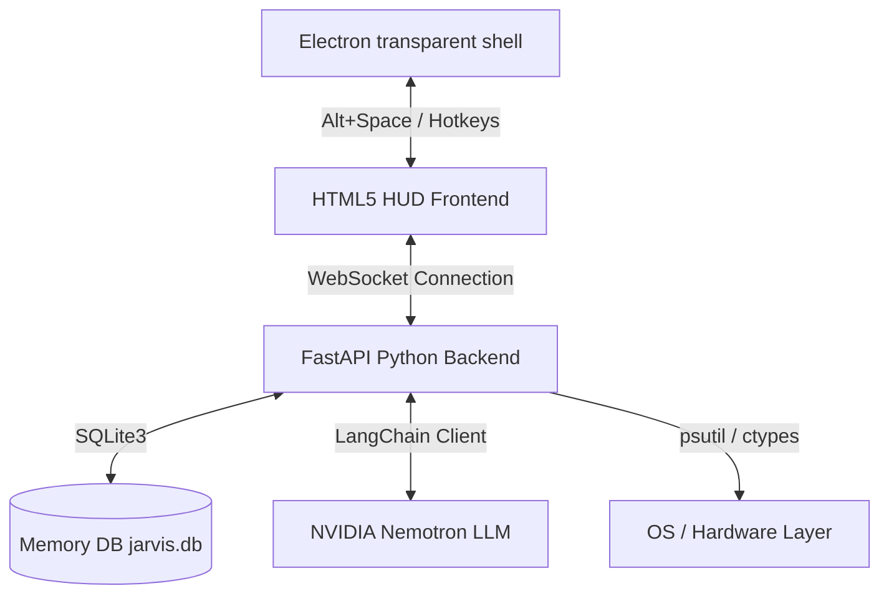

# JARVIS - Hacker HUD Personal AI Agent

JARVIS is a premium, Cyberpunk/Fallout terminal-style desktop assistant overlay. It wraps a responsive HTML5/JS Hacker HUD UI in an transparent Electron frame and communicates via WebSockets with a background Python FastAPI server. It is powered by the **NVIDIA Nemotron 3 Ultra (550b)** model to execute complex agent workflows and native system tools on Windows.

---

## 🏗️ Architecture Overview

The system is split into a high-performance frontend overlay (ASR/TTS, Waveform rendering) and a sandboxed Python backend (system vitals, local SQLite database, and LangChain model connections).



---

## 📺 Hacker HUD Features

* **Phosphor CRT Aesthetic**: Vibrant phosphor green layouts with scanline layers, glowing typography, pulse animations, and custom scan grids.
* **Alt+Space Toggle**: Transparent, frameless overlay window that hides to the Windows System Tray and pops up with a global keybinding.
* **Direct Voice ASR/TTS**: Leverages Google Chrome's Web Speech API (`webkitSpeechRecognition` and `speechSynthesis`) for sub-second voice inputs and audio speech responses with **barge-in** (voice interruption) capabilities.
* **Canvas Waveform**: Renders a custom glowing canvas audio waveform showing voice activity.
* **Telemetry Panels**: Displays real-time hardware statistics (CPU, RAM, battery, active process count, network traffic) using `psutil`.
* **Memory Core Viewer**: Shows long-term learned facts loaded from the SQLite database.
* **Terminal Action Logs**: Outputs a scrolling command line log showing real-time agent thinking process and tool results.

---

## 🔒 Security Model & Tool Matrix

All privileged operations are intercepted by the FastAPI middleware and checked against the Safety Access levels. When a Tier 2 action is invoked, a **confirmation modal** overlay freezes the interface, requiring manual authorization before executing.

| Tool Name | Action | Permission Tier | Authorization |
|---|---|---|---|
| `system.stats` | Read hardware telemetry | Tier 0 | Auto-approved |
| `fs.list` | List directory contents | Tier 0 | Auto-approved |
| `fs.read` | Read text file contents | Tier 0 | Auto-approved |
| `clipboard.read` | Read clipboard text | Tier 0 | Auto-approved |
| `app.launch` | Launch a Windows application | Tier 1 | Auto-approved |
| `browser.open_url`| Open URL in default browser | Tier 1 | Auto-approved |
| `screen.capture` | Take desktop screenshot | Tier 1 | Auto-approved |
| `clipboard.write`| Set clipboard contents | Tier 1 | Auto-approved |
| `fs.write` | Write/create files | Tier 2 (Sensitive) | **HUD Modal Prompt** |
| `fs.delete` | Delete files from disk | Tier 2 (Sensitive) | **HUD Modal Prompt** |
| `shell.run` | Run arbitrary CMD commands | Tier 2 (Sensitive) | **HUD Modal Prompt** |

---

## 📂 Project Structure

```
jarvis/
├── main.js                 # Electron main process (tray, hotkeys, window settings)
├── preload.js              # Electron secure IPC bridge
├── package.json            # Electron package specifications
├── setup.bat               # Automated node modules & virtualenv provisioner
├── start.bat               # Boot script (server + client launcher)
├── src/
│   ├── index.html          # Hacker HUD DOM layout & CRT elements
│   ├── style.css           # Phosphor styling & scanline filters
│   └── app.js              # WebSocket, ASR/TTS, and waveform logic
└── backend/
    ├── requirements.txt    # Python packages list
    ├── server.py           # FastAPI WebSocket backend & stats monitoring
    ├── agent.py            # LangChain model stream & prompt orchestrator
    ├── memory.py           # SQLite db context (conversation, facts, audit logs)
    └── tools.py            # Native OS command wrappers (fallbacks for win32)
```

---

## 🚀 Getting Started

### 📋 Prerequisites
* **Windows OS**
* **Node.js** (v18+)
* **Python** (3.10+)
* **NVIDIA NIM API Key**: Generate a key from the [NVIDIA API Catalog](https://build.nvidia.com/).

### 🛠️ Setup Instructions
1. Clone this repository (or open this directory).
2. Create a `.env` file in the project root:
   ```env
   NVIDIA_API_KEY=nvapi-...
   ```
3. Run the automated installer:
   ```cmd
   setup.bat
   ```
   *This initializes `node_modules`, creates a Python virtual environment (`backend/.venv`), and installs all dependencies.*

### ⚡ Running JARVIS
Double-click the startup script:
```cmd
start.bat
```
*This boots the FastAPI background server, waits 3 seconds, and opens the Electron HUD interface.*

---

## 🧠 Database Storage (SQLite)

Local conversation logs and memory facts are saved in `backend/jarvis.db` across three primary tables:
* **`conversation_history`**: Records role, message content, and timestamps.
* **`facts`**: Tracks facts extracted by the agent (e.g. user preferences) with uniqueness constraints.
* **`action_audit_log`**: Records all tool calls, permission levels, user authorizations, and outcomes.
